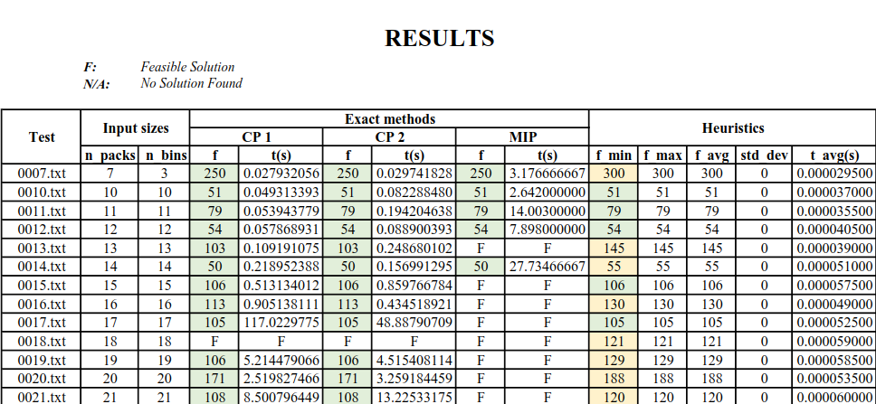
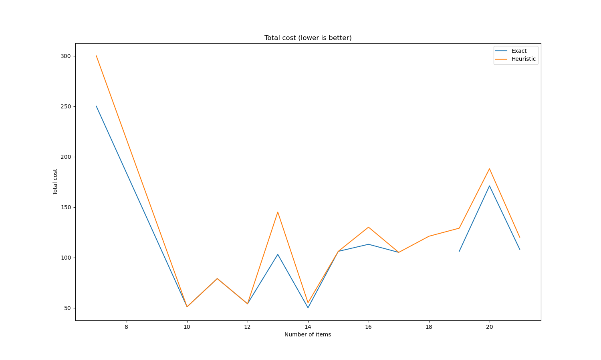
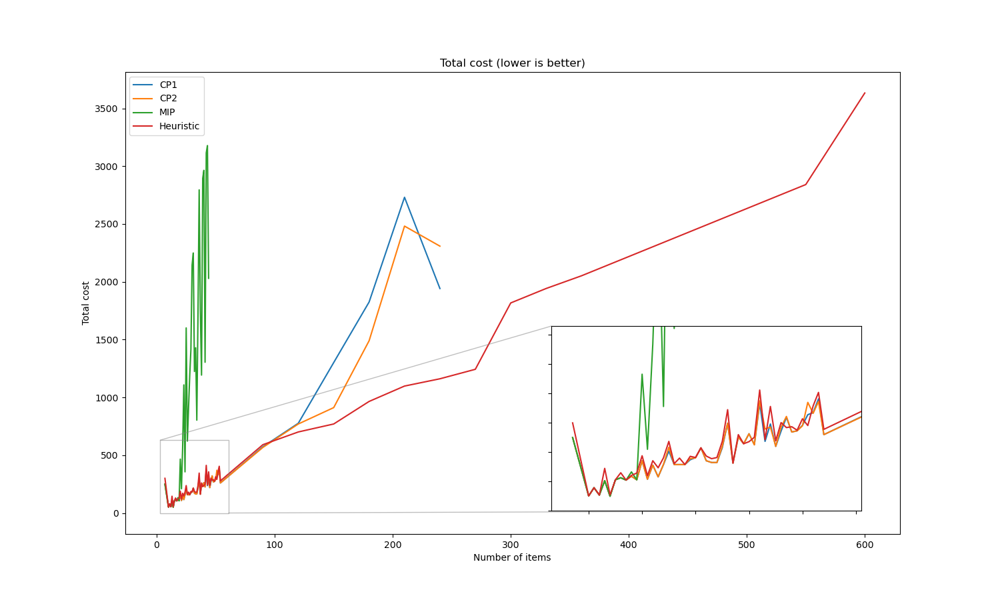
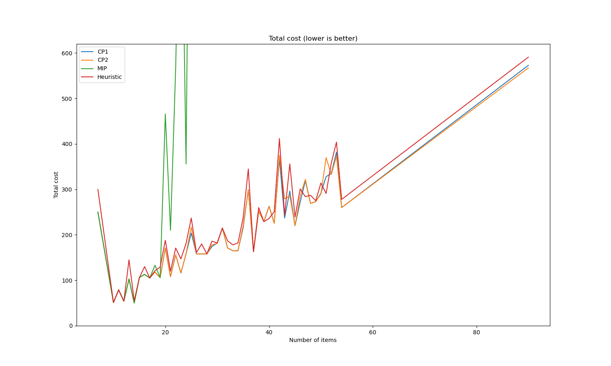
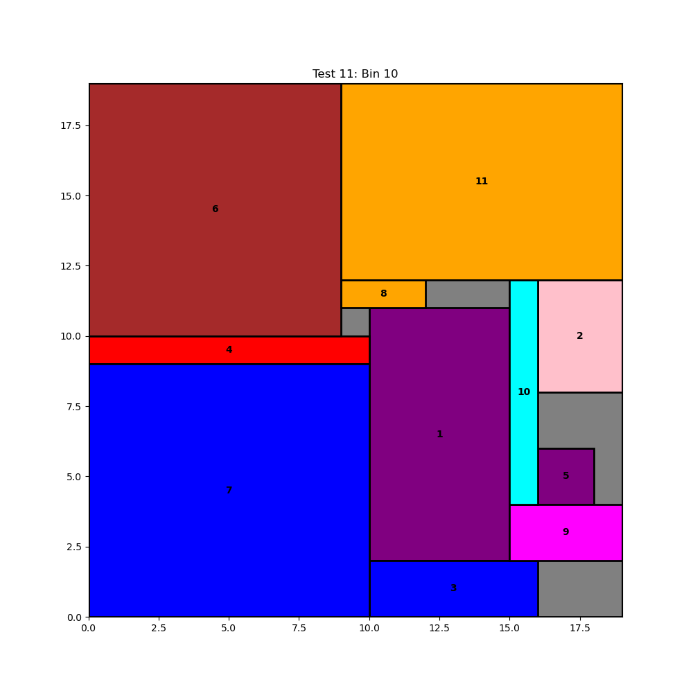

# Multiple-type, two-dimensional finite bin packing problem
This is a mini-project for topic 3 in Fundamentals of Optimization course of SoICT - HUST
## Problem
`K` trucks `1, 2, ..., K` are available for transporting `N` packages `1, 2, ..., N`. Each truck `k` has the container size of `Wk x Hk`. The dimensions of each package `i` are `wi x hi`. Packages that are placed in the same container must not overlap. Assume that the number K can be large, leading to a great number of trucks that are not being used. `Ck` represents the cost of using truck `k`. Find a solution that loads all the packages into those given trucks such that **the total cost of trucks used is minimal**.  

*Throughout our mini-project, some concepts are also being used instead of trucks (bins, cars) and packages (items)*

The input data format and how we generated them can be found [here](./input_data/README.md)   

Usage can be found [here](./USAGE.md)

## Our team
| Name            | Studenn ID | Mail                          |
|-----------------|------------|-------------------------------|
| Chu Minh Ha     | 20210293   | ha.cm210293@sis.hust.edu.vn   |
| Phan Dinh Nhat  | 20210654   | nhat.pd210654@sis.hust.edu.vn | 
| Do Quang Minh   | 20210579   | minh.dq210579@sis.hust.edu.vn |
| Nguyen Huu Duan | 20214951   | duan.nh214951@sis.hust.edu.vn |  

**Please refer to our [full report](./Report_FundamentalsofOptimization_IT3052E.pdf) for a detailed description of our problem modeling process, data generation methods, results, and additional information.**

## Folder structure
```
.
├── analyze                 # contains some analysis information
│   └── ...
├── CP_model.pdf            # how we model the problem
├── MIP_model.pdf
├── Heuristic.pdf
├── assets
├── figure                  # contains generated figures
│   ├── generated_CP
│   │   └── ...
│   ├── generated_HEU
│   │   └── ...
│   └── gen_figure.py       # figure generator
├── input_data              # contains generated data
│   └── ...
├── presentation
├── results                 # contains results from solver
│   └── ...
├── script                  # script file for collect result and gen figure
│   └── ...
└── solver_file             # contains solver files
    ├── CP_model_solver
    │   └── ...
    ├── Heuristic
    │   └── ...
    └── MIP_model.py
```

## Results
Here, we just need **the number of used bins and the total cost**, so for the real running time results, we omitted the printing code of the detailed packing methods **(this affects quite a bit the actual runtime of the solver)**.
- The results for each model are shown in the `results` folder
- An overview of the results can be found [here](./results/results.pdf)
- CP and MIP model solvers only receive input data up to **600 packages**   
- You can use google colab to run our project like [this](https://colab.research.google.com/drive/1ouxqr2eeJTfJou74Oxw4Syih_zFGgm2p?usp=sharing)    

If you want to collect results by yourself, you can run the `collect_results` script by this command in the **root dir** of the repository:
```
./script/collect_results.sh {mode} {attempt}
```
Available solver modes: `CP1`, `CP2`, `MIP`, `HEU`

Example:
```
./script/collect_results.sh HEU 1
```  
The commmand above will collect the results created by [heuristic_main](/solver_file/Heuristic/) in the `1st attempt`     
  
  
  
**Note:**   
**- Read the script for more details**  
**- Change the attempt number for each attempt or the results will rewrite each other**

## Analysis
**Exact solution:**
- CP gives exact solutions for tests with sizes: `7 x 3`, `10 x 10`, `11 x 11`, `12 x 12`, `13 x 13`, `14 x 14`, `15 x 15`, `16 x 16`, `17 x 17`, `19 x 19`, `20 x 20`, `21 x 21`.
- MIP gives exact solutions for tests with sizes: `7 x 3`, `10 x 10`, `11 x 11`, `12 x 12`, `14 x 14`.  

<!-- | Input    	|       |    CP 1       |       |      CP 2     |       |       MIP     |       |       Heuristic       |
|----------	|-----	|-------------	|-----	|-------------	|-----	|-------------	|-----	|---------------------	|
|          	| f   	| t (s)       	| f   	| t (s)       	| f   	| t (s)       	| f   	| t (s)               	|
| 0007.txt 	| 250 	| 0.027932056 	| 250 	| 0.029741828 	| 250 	| 3.176666667 	| 300 	| 0.000063000 	|
| 0010.txt 	| 51  	| 0.049313393 	| 51  	| 0.082288480 	| 51  	| 2.642000000 	| 51  	| 0.000119500 	|
| 0011.txt 	| 79  	| 0.053943779 	| 79  	| 0.194204638 	| 79  	| 14.00300000 	| 79  	| 0.000111500 	|
| 0012.txt 	| 54  	| 0.057868931 	| 54  	| 0.088900393 	| 54  	| 7.898000000 	| 54  	| 0.00012350  	|
| 0013.txt 	| 103 	| 0.109191075 	| 103 	| 0.248680102 	|     	|             	| 145 	| 0.000121000 	|
| 0014.txt 	| 50  	| 0.218952388 	| 50  	| 0.156991295 	| 50  	| 27.73466667 	| 55  	| 0.000147000 	|
| 0015.txt 	| 106 	| 0.513134012 	| 106 	| 0.859766784 	|     	|             	| 106 	| 0.000147500 	|
| 0016.txt 	| 113 	| 0.905138111 	| 113 	| 0.434518921 	|     	|             	| 130 	| 0.000178500 	|
| 0017.txt 	| 105 	| 190.2477704 	| 105 	| 48.88790709 	|     	|             	| 105 	| 0.000175500 	|
| 0018.txt 	|     	|             	|     	|             	|     	|             	| 121 	| 0.000196500 	|
| 0019.txt 	| 106 	| 5.214479066 	| 106 	| 4.515408114 	|     	|             	| 129 	| 0.000239000 	|
| 0020.txt 	| 171 	| 2.519827466 	| 171 	| 3.259184459 	|     	|             	| 188 	| 0.000226000 	|
| 0021.txt 	| 108 	| 8.500796449 	| 108 	| 13.22533175 	|     	|             	| 120 	| 0.000229500 	| -->





**All:**
- CP cannot handle data sets larger than 240 x 240. 
- MIP cannot handle data sets larger than 44 x 44.
- Heuristic can handle all test cases (the largest test size is 10,000 x 10,000).

**Comparing all results (total cost):**
- MIP gives the **worst** results.
- CP1 and CP2 give **nearly equivalent** results, but with larger data sets, CP2 gives better results.
- Heuristic gives really good results, with tests of size <100 x 100 it is still a bit inferior to CP, but for all other tests it is significantly better.




**Comparing all run time:**

- MIP reaches the time limit of 300 seconds for all tests with size >= 15 x 15.
- CP reaches the time limit of 300 seconds for all tests with size >= 22 x 22.
- Heuristic has a very short run time, every test is under 1 second, even for the test size of 10,000 x 10,000.


**Therefore:**

- MIP is not good in terms of results and run time,
- CP is better than MIP, with better results and faster run time (in some early tests),
- Heuristic gives the best results in both cost and run time. 

## Visualizer
We have generated some figures for the results of the CP solver and Heuristic solver. We did not generate any figures for the MIP solver due to its long running time and poor performance, so it is not necessary to include them.     
  
You can generate with this command:  
```
./script/gen_figure.sh {mode}
```
**Note: Currently, the script can only generate figure for the CP and Heuristic solver** 
  
  

