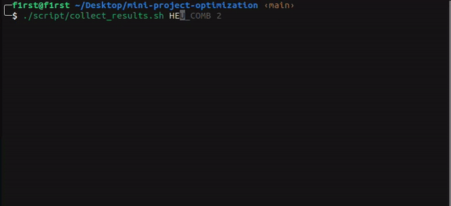

# Usage

To use this project, follow these steps:

- Dowload the latest release of this project in `releases` section.
- Generate input date by runing `data_gen.py` file in `input_data` folder.    
(The input format is in [here](/input_data/README.md))
- Collect results by running the `collect_results` script in the **root dir** of the repository:
    ```
    ./script/collect_results.sh {mode} {attempt}
    ```
    Available solver modes: `CP1`, `CP2`, `MIP`, `HEU`

    Example:
    ```
    ./script/collect_results.sh HEU 1
    ```  
    The commmand above will collect the results created by [heuristic_main](/solver_file/Heuristic/) in the `1st attempt`     
    
      
- The results for each model are shown in the `results` folder. Its has:
    - test size: number of bin and number of item
    - results: number of bin used and the total cost
    - status: optimal or just feasible
    - running time and the real run time
    - time limit (for CP and MIP)

    With these information, you can easily perform analysis for your self

- For visualization, run this command in the **root dir**:
    ```
    ./script/gen_figure.sh {mode}
    ```
    Note: 
    - Currently, the script can only generate figure for the `CP` and `Heuristic` solver
    - Config the ammount of test you want to generate figure for in the script file


